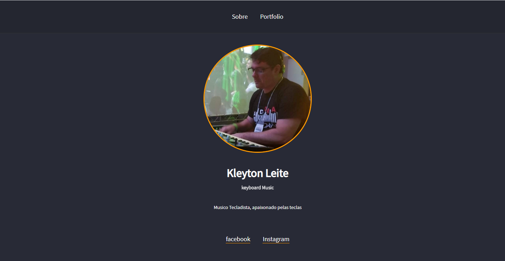

<h1 align="center">
  
</h1>

## 📝 Description

**Pesonal Page** is a project developed inspired by **LauchBase** from Rocketseat School.

---

## 💻 Used Technologies

This project has been developed using the following technologies:

- HTML
- CSS
- JavaScript
- [Nunjucks](https://mozilla.github.io/nunjucks/)

---

## 📁 Download

```bash

# Clone the repository
$ git clone https://github.com/KleytonLeite/Pesonal-Page.git

# Enter into the directory
$ cd Personal-page

# Install dependencies
$ npm install

# Start the server
$ npm start

```

---

Made with 💙 by Kleyton 👋🏻 [Get in touch!](https://www.linkedin.com/in/kleyton-leite-a384a76b/)